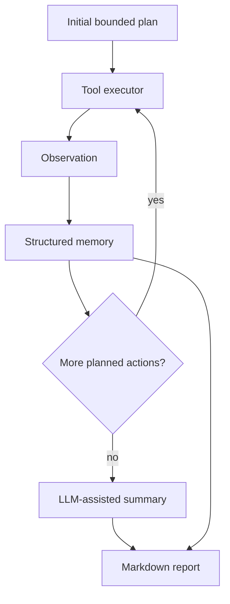

# Design Document

## 1. LLM Choice

**Model:** `gemini/gemini-2.5-flash` through LiteLLM. During implementation, Codex GPT-5.5 Thinking was used as the coding assistant. The official validation flow used the configured Gemini model for the harness credential check and attempted run summary; the agent falls back to a deterministic summary if the model is unavailable or produces report-sized output.

**Why this model:** Gemini 2.5 Flash was fast enough for the harness dry run, and the project benefits from a model that can summarize structured observations without making the run expensive. I did not put critical exploit behavior behind free-form model output. Juice Shop has repeatable local API surfaces, so deterministic tools are more reliable for the first working version than asking the model to invent every request.

## 2. Agent Architecture

**Pattern chosen:** Plan-and-Execute/ReAct hybrid.

**Why this architecture:** Juice Shop exposes stable routes such as `/api/Challenges/`, `/rest/products/search`, `/rest/user/login`, `/ftp`, and the SPA bundle. The first HTTP-only agent plateaued around 15 solved because several easy challenges are triggered only by Angular routes, DOM rendering, or multi-step application workflows. The current bounded plan keeps the original deterministic HTTP phases, adds a challenge-aware solver suite, then runs Playwright browser exploration before the final status check. The ReAct part is still the observation loop: each tool result updates memory, records newly solved challenges, can enqueue a follow-up such as JWT inspection, and becomes report evidence.

### Rejected alternatives

I rejected a pure LLM ReAct loop where the model chooses every HTTP request. It is flexible, but it tends to waste steps rediscovering the same endpoints and can drift into generic advice. I also rejected a browser-only rewrite because the HTTP tools already solve many stable API challenges quickly; Playwright is now an additive layer for route and DOM challenges, not a replacement for the original architecture.

## 3. Prompting Strategy

**System prompt structure:** `agent/prompts/system.md` defines role, local-only scope, goals, safety constraints, and evidence rules. `agent/agent.py` loads this prompt for the LLM-assisted run summary, and `agent/prompts/report.md` is prepended to the summary request so report language is tied to the same evidence-only rules. The prompts tell the model to separate confirmed evidence from hypotheses because the report rubric rewards real request/response artifacts.

**Task decomposition:** The code decomposes the run into phases: challenge status, endpoint discovery, API fuzzing, SQLi probing, JWT inspection if a token is captured, deterministic solver suite, browser exploration, and final status. The LLM is used for the final summary, not for the core exploit execution.

**What did you try and discard?** I initially followed the scaffold's suggestion of a model-driven tool-call loop, but that would block the entire run on LLM credentials and make early debugging harder. The first working version instead uses deterministic tools and keeps the LLM on summarization so the agent still produces useful logs when a model call fails.

## 4. Tool Design

| Tool | Purpose | Why built |
|---|---|---|
| `endpoint_discovery` | Crawl local HTML/JS, parse links, scripts, API paths, and probe common Juice Shop routes | Recon should be deterministic and reusable rather than hidden in model reasoning |
| `sql_injection_tester` | Test bounded login and search SQLi payloads and capture auth token/evidence | SQL injection is a core Juice Shop lesson and needs structured request/response proof |
| `api_fuzzer` | Probe safe API, metrics, FTP/null-byte file, header, and feedback behaviors | Adds breadth beyond login SQLi while avoiding destructive fuzzing |
| `challenge_status` | Query `/api/Challenges/` and summarize solved state | Lets the agent measure progress before and after exploitation |
| `jwt_inspector` | Decode captured JWT header/payload without verifying signature | Turns an auth token into reportable evidence and possible follow-up context |
| `challenge_solver_suite` | Runs challenge-aware local workflows for registration, reset-password, uploads, feedback, CSAF, credentials, basket/order, and SQLi proof actions | Converts one-off manual probes into repeatable, progress-tracked solver phases |
| `browser_explorer` | Uses Playwright to visit Angular routes, preserve auth state, trigger DOM XSS payloads, and collect screenshots | Covers route/DOM challenges the HTTP-only version could not trigger |

The tools expose high-level switches instead of arbitrary URLs. That keeps the agent scoped to the configured target and avoids accidentally building tooling for public systems. Code handles request generation, parsing, and evidence capture; the LLM is left to summarize and explain the evidence.

## 5. Context / Memory Management

The agent stores structured memory in dataclasses instead of appending an unlimited chat transcript. `AgentMemory.compact()` keeps finding records, discovered paths, scoreboard counts, and recent observation summaries. Full observations go to `agent_logs/<timestamp>/events.jsonl`, while the LLM summary receives only the compact memory.

Looping is prevented by a finite action queue and deduplication of findings by title, endpoint, and source tool. The agent remembers solved counts before and after the run through `challenge_status`, and records per-phase progress events with newly solved challenge names. It stops after the browser/progress phases once the target score of 50 is reached.

## 6. Attack Strategy

The agent starts with coverage, then moves to likely low-hanging Juice Shop vulnerabilities. It discovers endpoints from the SPA bundle, probes known API patterns, checks exposed metrics and FTP files, attempts bounded SQLi against login/search, performs known demo credential checks, runs safe reset-password workflows for seeded Juice Shop users, submits contact/feedback proofs for CSAF/crypto/component challenges, validates upload and XXE file-disclosure challenges, places the deleted Christmas product order, then uses Playwright for Score Board, Privacy Policy, Admin Section, Web3 Sandbox, DOM XSS, and Bonus Payload. The final validated score is 50 / 111.

## 7. Observed Failures

1. **Failure:** The early HTTP-only agent could discover Angular fragment routes such as `/#/score-board` and `/#/search`, but it could not trigger DOM-only challenges.  
   **Diagnosis:** Juice Shop awards several challenges only after browser-rendered routes or client-side JavaScript execute. Plain `httpx` requests see the server response, but they do not run Angular, trigger dialogs, or populate browser storage.  
   **Fix:** Added `browser_explorer`, a Playwright-backed tool that opens local routes, preserves the captured auth token in browser storage, triggers DOM XSS and Bonus Payload URLs, and saves screenshot evidence.

2. **Failure:** The deterministic API tools solved many server-side challenges, but the run plateaued on UI and workflow-heavy coverage.  
   **Diagnosis:** A general HTTP fuzzer is good at finding exposed files, metrics, SQLi, and API validation issues, but Juice Shop also rewards multi-step flows such as registration edge cases, reset-password answers, feedback deletion, uploads, XXE proof, and order placement.  
   **Fix:** Added `challenge_solver_suite` as a bounded local workflow tool. It uses `/api/Challenges/` as a read-only progress oracle and records before/after solved counts for each action instead of claiming success from HTTP status alone.

3. **Failure:** The prompt files existed, but the first implementation did not clearly connect them to the running agent.  
   **Diagnosis:** That weakened the `agent/prompts/` deliverable because the prompts were documented but not meaningfully used by the architecture.  
   **Fix:** Updated `agent/agent.py` to load `agent/prompts/system.md` and `agent/prompts/report.md` into the LLM-assisted summary path.

4. **Failure:** Gemini once produced a long mini-report when asked for a short executive summary.  
   **Diagnosis:** Even with a report prompt, model output can be over-complete and duplicate the deterministic Markdown report body.  
   **Fix:** Added a guard that falls back to a concise deterministic summary if the LLM output is empty, too long, or starts emitting Markdown sections. The final report body still comes from structured findings and tool evidence.

5. **Failure:** In a restricted shell run, Playwright failed with a Windows `PermissionError` while launching its browser subprocess.  
   **Diagnosis:** This was an execution-environment permission issue, not a Juice Shop or Docker issue. The agent caught the tool failure, continued to the final status check, and still generated a report.  
   **Fix:** Reran the official validation with normal permission to launch Playwright. The successful run completed `browser_explorer`, saved browser evidence screenshots, and `eval.harness --report` confirmed 50 / 111 solved.

6. **Failure:** After the application already had 50 solved challenges, later agent reruns showed `50 -> 50` progress for solver and browser phases.  
   **Diagnosis:** Juice Shop challenge state persists in the running container, so a rerun should not pretend to newly solve challenges that were already solved.  
   **Fix:** The report now states solved-before and solved-after counts and lists `new: none` when no additional challenges were unlocked during that particular run.

## 8. Limitations

This version now drives a headless Chromium browser, but it is still conservative. It avoids DoS/RCE/deserialization bomb challenges, broad brute force, external scanning, and high-risk browser flows. It does not yet solve the more complex JWT forgery, two-factor-authentication, coupon forgery, NoSQL, SSRF, blockchain/NFT, or advanced stored XSS challenges. The weak credential checks are limited to known Juice Shop demo users from the local lab.

## 9. Future Work

The next improvements would be targeted solvers for the remaining high-value categories rather than a broad rewrite: JWT forgery with controlled signing experiments, coupon-code analysis, two-factor-authentication workflows, safer SSRF-only-local probes, and more complete stored-XSS workflows with browser confirmation. I would also add a cleaner screenshot capture mode that emits writeup-ready terminal and scoreboard artifacts after each official run.

## 10. Citations

- **External code/libraries:** Project scaffold dependencies in `requirements.txt`: LiteLLM, httpx, Pydantic, BeautifulSoup, Rich, PyJWT, Playwright.
- **External sources:** OWASP Juice Shop project concept and local training target from the assignment README. No external exploit write-ups or copied code were used.
- **AI assistance:** Chat GPT-5.5 Thinking helped implement the agent, tools, report generator, and this design draft under my instructions. The runtime model remains configurable through LiteLLM.
