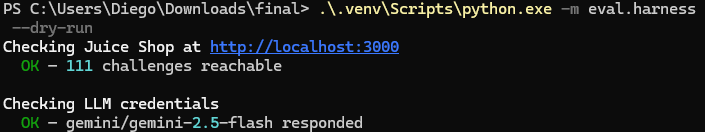
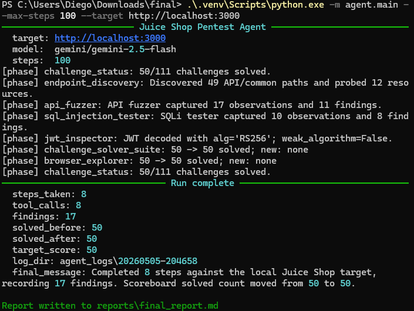
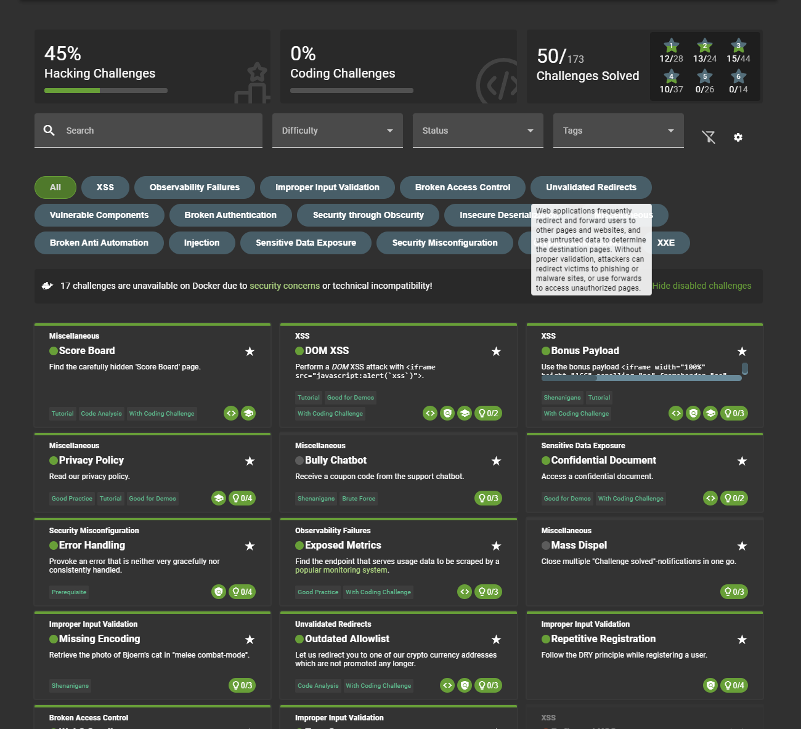
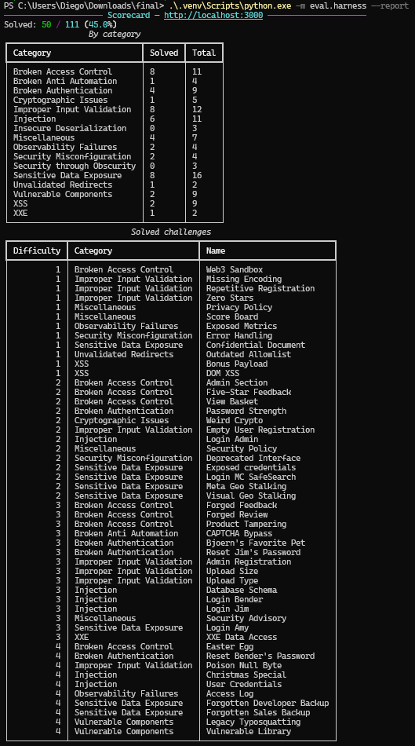
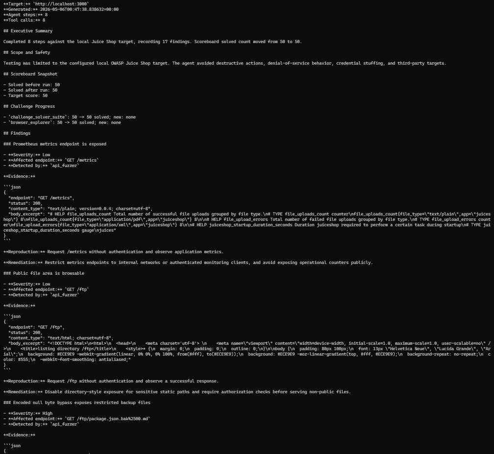
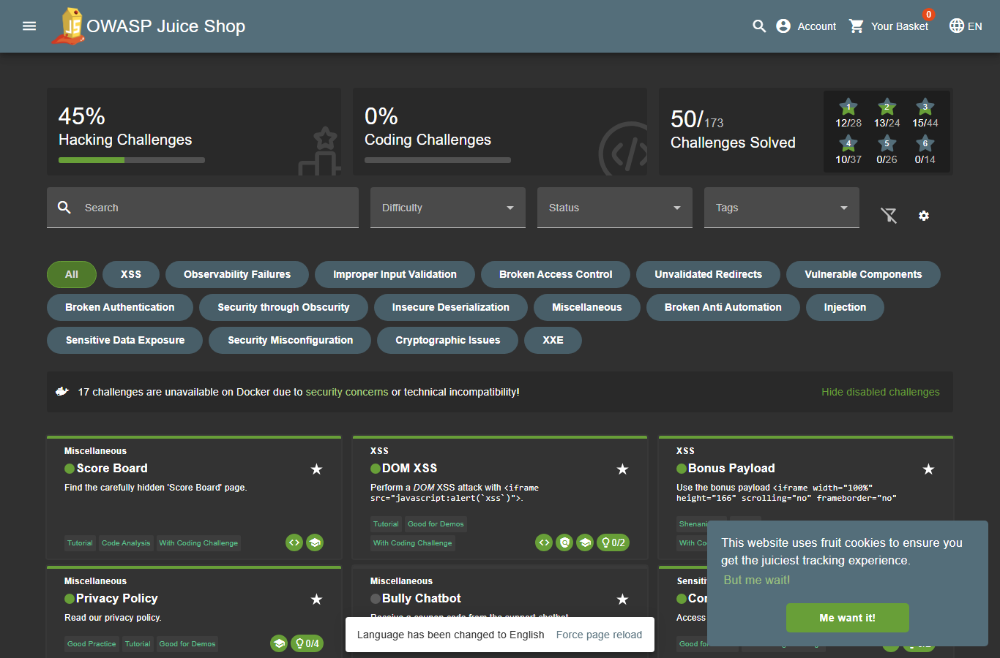
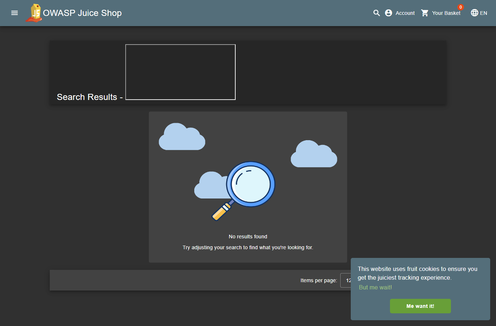
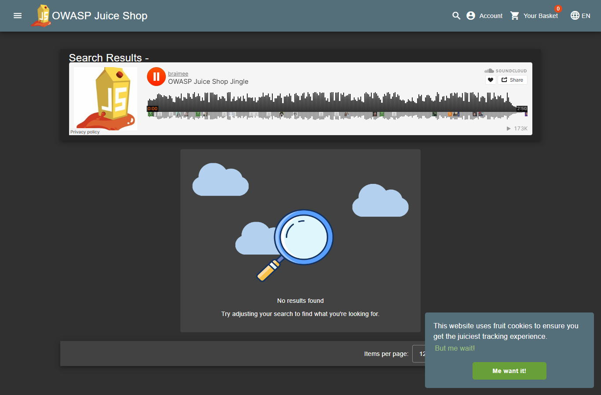
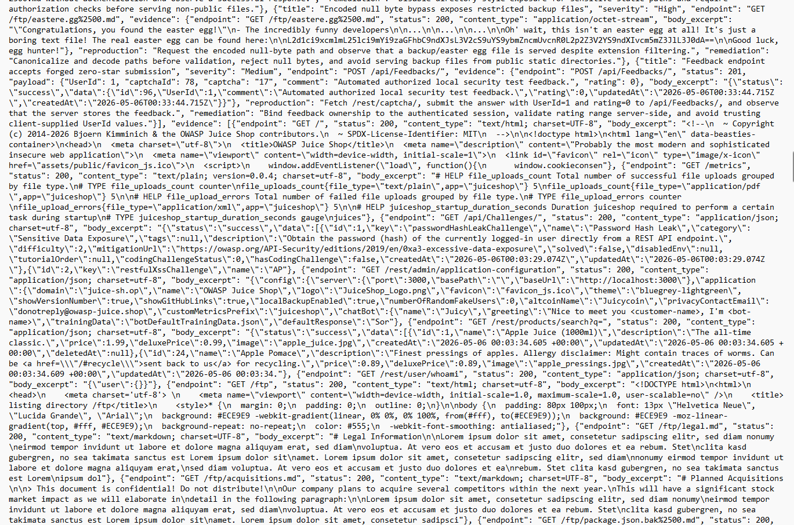

# Project Writeup

## 1. Setup & Environment

- **OS / Python version:** Windows, project venv currently uses Python 3.14.0.
- **LLM used:** `gemini/gemini-2.5-flash` through LiteLLM for the official validation run. Codex GPT-5.5 Thinking was used for implementation assistance.
- **Juice Shop version:** Docker image `bkimminich/juice-shop:latest` from `docker-compose.yml`.
- **Browser automation:** Playwright with Chromium. Install command if rebuilding the environment:

```powershell
.\.venv\Scripts\python.exe -m pip install playwright
.\.venv\Scripts\python.exe -m playwright install chromium
```

**Screenshot 1 - Juice Shop running:** Capture the Juice Shop homepage at `http://localhost:3000` and a terminal with `docker compose ps` or `docker ps`.


**Screenshot 2 - Dry run passing:** Capture:

```powershell
.\.venv\Scripts\python.exe -m eval.harness --dry-run
```

It should show Juice Shop reachable and `gemini/gemini-2.5-flash` responding.



## 2. Successful End-to-End Run

**Screenshot 3 - Agent terminal output:** Capture:

```powershell
.\.venv\Scripts\python.exe -m agent.main --max-steps 100 --target http://localhost:3000
```

Annotate the target/model header, the deterministic solver phase, the browser explorer phase, the solved count, and the report path.



**Screenshot 4 - Juice Shop scoreboard after run:** Open `http://localhost:3000/#/score-board` and capture the visible solved challenges.



**Screenshot 5 - Scoring harness output:** Capture:

```powershell
.\.venv\Scripts\python.exe -m eval.harness --report
```

The final validation score was 50 / 111 solved.



**Screenshot 6 - Generated final report:** Capture `reports/final_report.md` open in your editor or terminal, showing the generated timestamp and at least one evidence block.



## 3. Deep Dive: One Challenge, Step by Step

**Challenge:** DOM XSS

**Step 1 - Discovery:** The HTTP-only agent found the Angular search route but could not execute DOM payloads. The Playwright browser layer opened `/#/search` as a real browser page.



**Step 2 - Reasoning:** The browser explorer uses the official Juice Shop DOM XSS training payload and listens for browser dialogs as evidence of execution.

Relevant excerpt from `agent_logs/20260505-203557/events.jsonl`:

```json
{
  "time": "2026-05-06T00:36:16.434260+00:00",
  "type": "tool_observation",
  "payload": {
    "step": 7,
    "tool": "browser_explorer",
    "ok": true,
    "summary": "Browser explorer completed 5 actions; 0 new challenges solved.",
    "result": {
      "phase": "browser_exploration",
      "solved_before": 50,
      "solved_after": 50,
      "actions": [
        {
          "action": "dom_xss_payload",
          "route": "/#/search",
          "payload": "<iframe src=\"javascript:alert(`xss`)\">",
          "dialogs": ["xss"],
          "evidence_path": "agent_logs\\20260505-203557\\browser_evidence\\dom_xss.png"
        },
        {
          "action": "bonus_dom_payload",
          "route": "/#/search",
          "evidence_path": "agent_logs\\20260505-203557\\browser_evidence\\bonus_payload.png"
        }
      ],
      "dialogs": ["xss"]
    }
  }
}
```

**Step 3 - Exploitation:** The tool navigates to `/#/search?q=<iframe src="javascript:alert(`xss`)">` and accepts the alert in Playwright.



**Step 4 - Confirmation:** The browser evidence screenshot is saved under the run log directory, and `eval.harness --report` lists `DOM XSS` and `Bonus Payload` as solved.



## 4. Failure Analysis

**Challenge attempted:** HTTP-only agent plateau around 15 solved.

**Screenshot 5 - The agent failing or plateauing:** Capture a run where the HTTP-only agent plateaus and cannot solve browser-route challenges.



**Why it failed:** The first implementation used HTTP tools only. Fragment routes such as `/#/score-board`, browser-rendered DOM payloads, and UI-only admin/privacy routes are handled client-side and do not always trigger challenge completion through server-side HTTP requests.

**What you tried:** Endpoint discovery found the routes, and the API solver handled several server-side challenges. The score remained low until Playwright was added and the challenge-aware suite encoded reset-password, file upload, CSAF, feedback, credential, and order workflows.

**What actually fixed it:** `browser_explorer` opens local Juice Shop routes, waits for Angular to render, handles DOM dialogs, and collects screenshots. `challenge_solver_suite` uses `/api/Challenges/` as a read-only progress oracle and records newly solved challenge names after each phase.

## 5. Iteration Log

- **Milestone 1:** Scaffold inspection and harness baseline.
- **Milestone 2:** Implemented endpoint discovery, API probing, SQL injection testing, challenge status, and JWT inspection tools.
- **Milestone 3:** Added structured agent memory, JSONL run logs, and Markdown report generation.
- **Final:** Added Playwright browser exploration and a deterministic challenge solver suite. Final validated score: 50 / 111.

## 6. Reflection

- One thing that worked better than expected: deterministic tools plus a small browser layer solved 50 challenges without needing long model-driven request planning.
- One thing that was much harder than expected: environment setup, especially Docker Desktop permissions and Python native wheel mismatches.
- One thing to do differently: add browser automation earlier for UI-only challenges.
- With another week: add targeted solvers for JWT forgery, coupon forgery, two-factor auth, SSRF, and the remaining stored XSS challenges.

## 7. Hours Spent

| Activity | Hours |
|---|---:|
| Environment setup | 1 |
| Reading/learning | 1 |
| Agent architecture | 2 |
| Tool development | 5 |
| Prompt iteration | 1 |
| Debugging | 3 |
| Writing design doc + writeup | 1 |
| **Total** | 14 |
