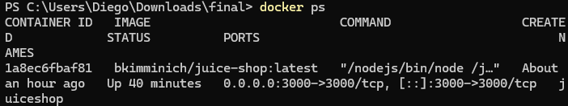

# Project Writeup

> Rename this file to `WRITEUP.md` and complete every section.
>
> This writeup replaces a live demo. Screenshots must be real and captured from your own runs. Faking screenshots or re-using the same screenshot across sections will be treated as academic dishonesty.
>
> Put images in `writeup_assets/` and reference them with relative links (``).

---

## 1. Setup & Environment

- **OS / Python version:**
- **LLM used:**
- **Juice Shop version:** (from `docker-compose.yml` or the container tag — use `docker inspect bkimminich/juice-shop`)

**Screenshot 1 — Juice Shop running:** Show the Juice Shop homepage and your terminal with `docker ps` proving the container is up. Include a visible timestamp somewhere (clock, terminal prompt, browser address bar time).

## 2. Successful End-to-End Run

**Screenshot 2 — Agent terminal output:** A screenshot of your terminal showing the agent mid-run. Annotate (with arrows, boxes, or captions) at least three specific things happening: e.g., "here the agent decides to probe the login endpoint", "this is the tool call that succeeded", "this message shows the agent recognizing it solved a challenge".

**Annotations:**
1. (Describe what is highlighted)
2. ...
3. ...

**Screenshot 3 — Juice Shop scoreboard after run:** The `#/score-board` URL, showing solved challenges. This image must be timestamp-consistent with Screenshot 2.

**Screenshot 4 — Scoring harness output:** The output of `python -m eval.harness --report` after the same run.

## 3. Deep Dive: One Challenge, Step by Step

Pick one challenge your agent solved and walk through exactly how. Screenshots + narration.

**Challenge:** (e.g., `loginAdmin`)

**Step 1 — Discovery:** What tool fired first? What did the agent observe?

**Step 2 — Reasoning:** Paste the relevant snippet of the LLM's reasoning (from your agent's log). What was it thinking?

> (paste reasoning here)

**Step 3 — Exploitation:** The exploit attempt. Show the request/response.

**Step 4 — Confirmation:** How did the agent know it succeeded? (Scoreboard update? Response signature?)

## 4. Failure Analysis

Every agent fails on some challenge. Pick one where yours got stuck, and explain why.

**Challenge attempted:**

**Screenshot 5 — The agent looping / failing:**

**Why it failed:** What structural limitation of your agent (prompting, tool, context, LLM choice) caused the failure?

**What you tried:** At least two interventions you attempted.

**What would actually fix it:** Not "try harder" — describe the concrete change that would be required.

## 5. Iteration Log

Briefly narrate how your agent evolved over the four-week project. What did the first working version look like? What changed between milestones?

- **Milestone 1:**
- **Milestone 2:**
- **Milestone 3:**
- **Final:**

Screenshots of earlier versions are optional but encouraged — they're strong evidence of authentic iteration.

## 6. Reflection

- One thing that worked better than expected:
- One thing that was much harder than expected:
- One thing you would do completely differently if you started over:
- If you had another week, what would you add?

## 7. Hours Spent

Rough estimate — for course planning, not grading.

| Activity | Hours |
|---|---|
| Environment setup | |
| Reading/learning | |
| Agent architecture | |
| Tool development | |
| Prompt iteration | |
| Debugging | |
| Writing design doc + writeup | |
| **Total** | |
